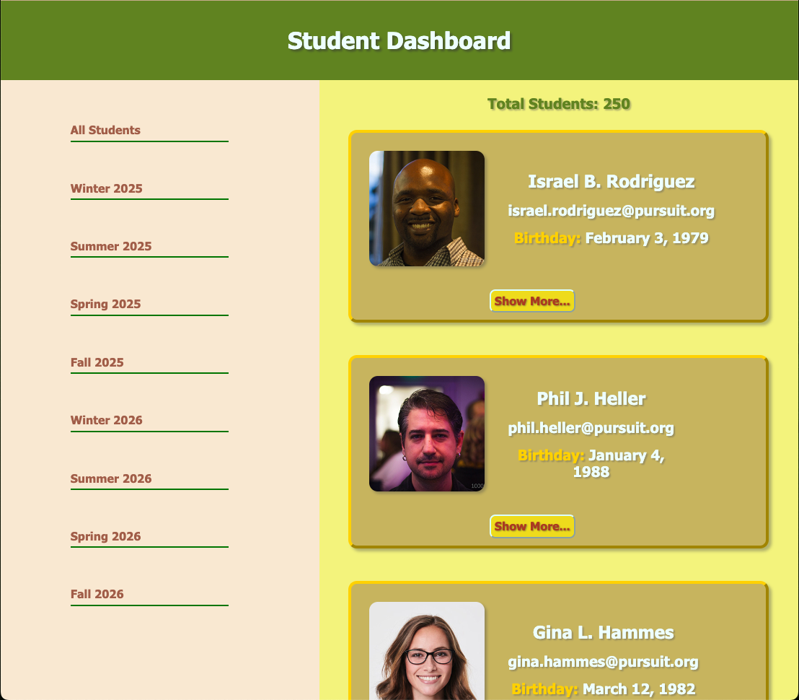
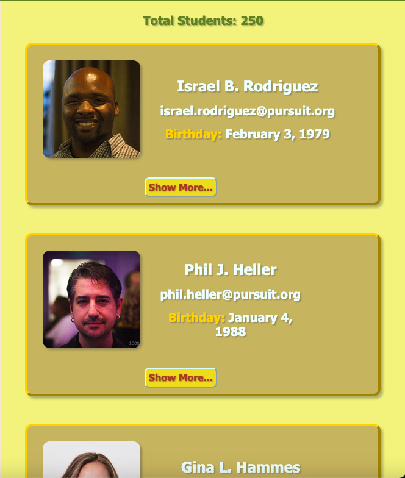
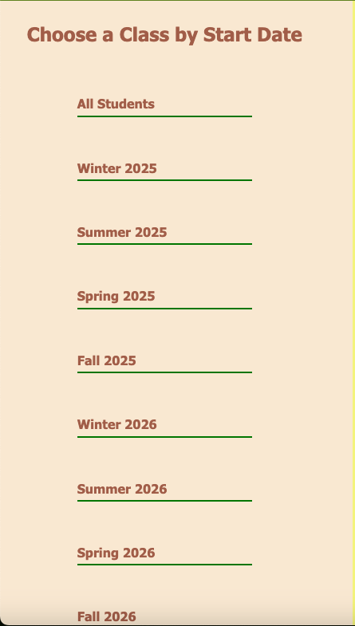
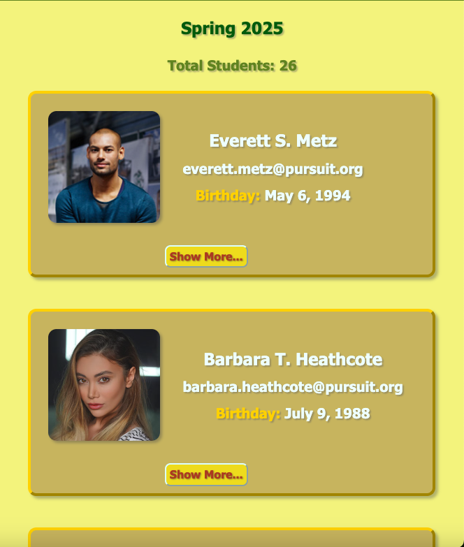
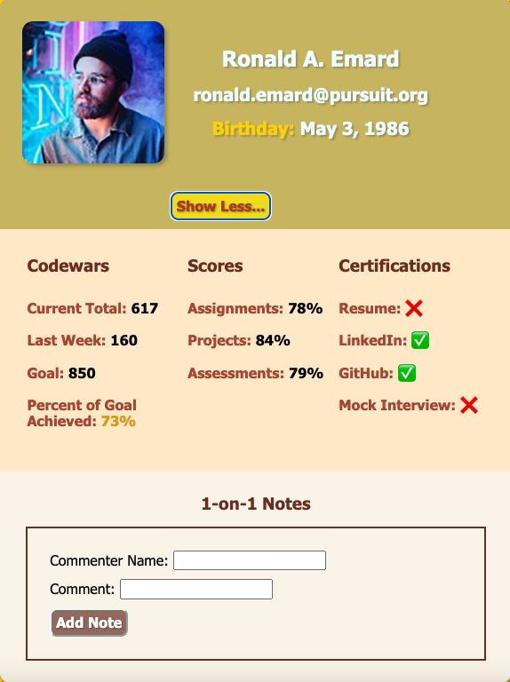
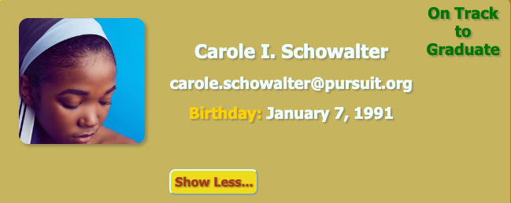

# Student Dashboard Project

[Project live site at Netlify](https://mkleemoff-10-1-student-dashboard.netlify.app/)

[Trello board for project](https://trello.com/b/ARQ7PzUa/101-student-dashboard-project-module-3)

### Description

---

This app is a front-end student dashboard that is built with React.js. When the app is loaded it displays all the students currently in the database. The app includes a menu of the student body split into cohorts that are organized by month and year. If a user click on a particular cohort, another list displays just those student belonging to the selected cohort. Each student has a card with their name, email, birthday and profile photo. A `Show More` button on each card when clicked, opens up a details list view displaying the stats for the user's _Codewars_, the percentages for their _Scores_ and whether they have certifications for their _Resume_, _LinkedIn_, _GitHub_ and _Mock Interview_. Additionally, within the details list view, a _1-On-1 Notes_ form is displayed, allowing a user to fill-out their name and a comment that when submitted with a `Add Note` button is displayed at the bottom of the details list view. When a student's _Codewars_ current total is over 600 and they are certified in all their certifications, an `On Track to Graduate` message is displayed on their respective card.

---

### Initial View

---

### Student List

---

### Cohort List Menu

---

### Specific Cohort View

---

### Details View with 1-On-1 Notes Section

---

### On Track to Graduate View

